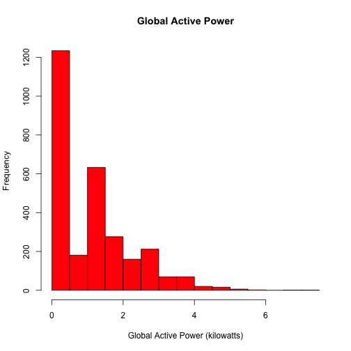

## SAVVAS CHATZIPAVLIDIS 
## ASSIGMENT 1 

## Loading the data

First of all notify that the data folder with the "household_power_consumption.txt" is gitignored because of his size.
So consider you already download it.

When loading the dataset into R, please consider the following:

* The dataset has 2,075,259 rows and 9 columns. First
calculate a rough estimate of how much memory the dataset will require
in memory before reading into R. Make sure your computer has enough
memory (most modern computers should be fine).

* We will only be using data from the dates 2007-02-01 and
2007-02-02. One alternative is to read the data from just those dates
rather than reading in the entire dataset and subsetting to those
dates.

* You may find it useful to convert the Date and Time variables to
Date/Time classes in R using the `strptime()` and `as.Date()`
functions.

## Making Plots

* Construct the plot and save it to a PNG file with a width of 480
pixels and a height of 480 pixels.

* Name each of the plot files as `plot1.png`, `plot2.png`, etc.

* Create a separate R code file (`plot1.R`, `plot2.R`, etc.) that
constructs the corresponding plot, i.e. code in `plot1.R` constructs
the `plot1.png` plot. Your code file **should include code for reading
the data** so that the plot can be fully reproduced. You should also
include the code that creates the PNG file.

* Add the PNG file and R code file to your git repository

When you are finished with the assignment, push your git repository to
GitHub so that the GitHub version of your repository is up to
date. There should be four PNG files and four R code files.

The four plots that you will need to construct are shown below. 

### Plot 1

 

### Plot 2

 

### Plot 3

 

### Plot 4

 

